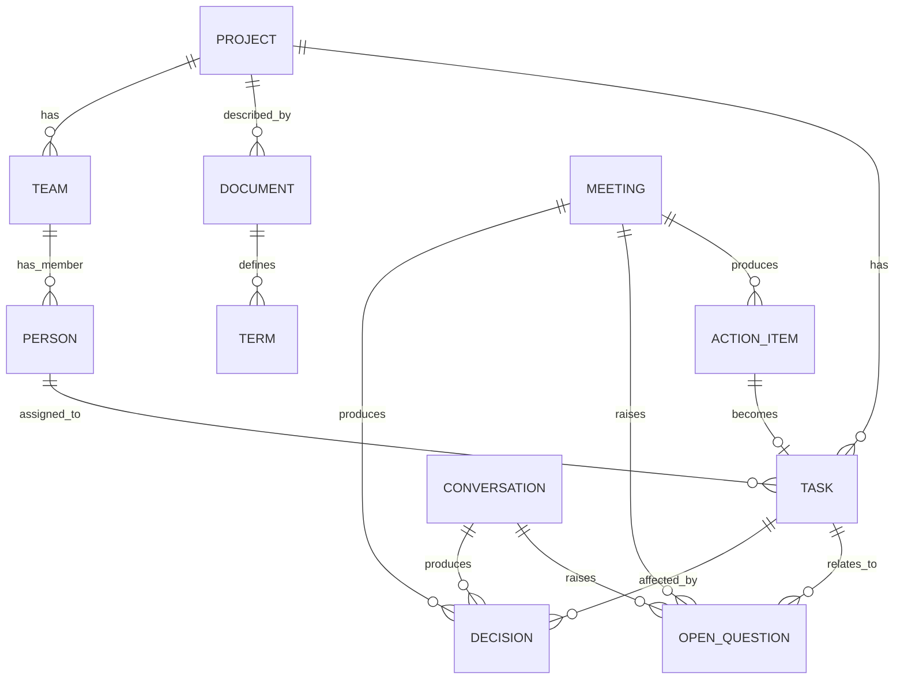
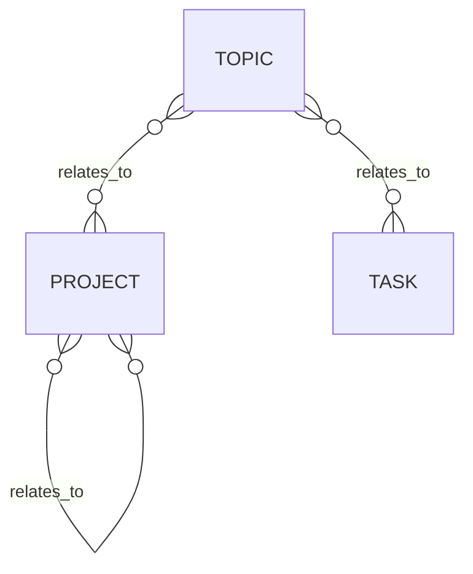

# Memory model

This document defines the structured memory model referenced as an open question in the
[product vision](../product-vision/overview.mdx#memory-and-context-architecture) and in
[Stage 1](../product-vision/stage-1-documentation.mdx). It covers the entity model across all
four MVP stages, so that each stage builds on a shared foundation instead of redesigning it.
Most entity types are only populated once the corresponding context source is connected; until
then they simply remain empty.

## Layers

The product vision describes memory as layered: raw content, extracted entities and facts,
structured project state, and summaries. Concretely:

1. **Raw layer**: source content as ingested, documents and their chunks, meeting transcripts,
   Slack messages, tracker records, each with a reference to where it came from and, for text,
   an embedding used for retrieval.
2. **Extracted entities and facts**: structured records extracted from raw content (see
   [entity model](#entity-model) below), each keeping a reference back to the raw item(s) it was
   extracted from.
3. **Structured project state**: the current, queryable picture of the project, built and kept
   up to date from extracted entities and facts. This is the layer chat queries and proactivity
   checks run against; it is not a log of everything ever extracted, but the current view,
   together with the provenance needed to answer "why does the assistant think this".
4. **Summaries**: generated from the structured layer on demand (meeting summaries, status
   summaries, conversation recaps), not stored as a separate source of truth.

## Entity model

Entity types are grouped by the stage that introduces them. Earlier entity types are referenced
by later ones (for example, a task extracted in Stage 3 can be assigned to a person introduced
in Stage 1).

### Stage 1: Project documentation

- **Project**: name, description.
- **Document**: a connected source document (markdown file or PDF), its location, type, and a
  content hash used to detect changes when it is re-ingested. Also carries an **origin**: a
  document reaches the permanent corpus either directly (dropped or selected outside a chat
  message) or by being promoted from a [chat attachment](#chat-attachments); see below.
- **Term**: a project-specific term and its definition.
- **Team**: a named group of people.
- **Person**: name and role.

"Structure" from the Stage 1 scope (team membership, project breakdowns, ownership) is not a
separate entity type, it is expressed as relationships between Project, Team, and Person.

### Stage 2: Meeting transcripts

- **Meeting**: date, participants, and a reference to its transcript in the raw layer.
- **Decision**: a decision made, with a description and the meeting or conversation it was made
  in.
- **Open question**: an unresolved question, with a description, where it was raised, and a
  status (open or resolved).
- **Action item**: a commitment or task-like item surfaced from a meeting, before it exists as a
  tracker task. Can later link to a Task once formalized.

### Stage 3: Task tracker (YouTrack)

- **Task**: title, description, status, assignee, and a reference to the tracker record. An
  action item from Stage 2 can link to a task once one is created for it.

### Stage 4: Slack

- **Conversation**: a channel or thread, its participants, and a reference to its messages in
  the raw layer.

Decisions and open questions from Stage 2 also apply to conversations from Stage 4 (a decision
or open question can come from a meeting or from a Slack thread).

### Chat sessions

Independent of the staged entity model above, the backend stores the user's chat sessions with
the assistant itself: a **Conversation** (a chat session, introduced in Stage 1) has many
**Message** rows (`role` of `"user"` or `"assistant"`, `content`, and for assistant messages a
snapshot of the chunks cited in that answer). These hold conversation history so follow-up
questions are understood in context (see [Stage
1](../product-vision/stage-1-documentation.mdx#chat)). They are session/application state, not
part of the raw -> extracted -> structured -> summary layers above, and are not themselves
extracted from. Distinct from Stage 4's **Conversation** entity above, which represents an
external Slack channel or thread.

A Conversation also has a `title`: a short summary generated by the LLM after its first turn
(once `answer` is available, so the title call can use both the question and the answer) and
never regenerated afterward. This backs the sidebar's conversation history list, letting a user
browse and resume past conversations instead of only ever starting a new one.

### Chat attachments

A file attached to a chat message is not automatically part of long-term memory. Attaching it
stages it as **ephemeral, conversation-scoped context**: parsed, chunked, and embedded like any
other document, but excluded from retrieval across the corpus and visible only within the
conversation it was attached to (any turn in that conversation, not just the one it was attached
to). This mirrors how Claude or ChatGPT treat a file dropped into a chat, distinct from
deliberately adding it to a project's permanent knowledge.

The two states are the same `Document`/`Chunk` rows, distinguished by `Document.origin`
(`"attachment"` for a staged, ephemeral document; `"ingested"` for one in the permanent corpus)
plus a `ConversationAttachment` join row (`conversation_id`, `document_id`) recording which
conversation(s) an ephemeral document is scoped to. **Promoting** an attachment (an explicit,
user-initiated "save to memory" action, never automatic) moves it into the permanent corpus by
running the same extraction and [project resolution](#incremental-updates-and-entity-resolution)
that a directly-connected document goes through, and flips its `origin`. Before promotion, the
attachment has no entities extracted, no project, and is invisible to any other conversation or
to the connected-corpus retrieval used by plain chat questions.

### Relationships

### Generic relations

The relationships above are structural: stable, named connections between specific entity types,
expressed as foreign keys (`Task.project_id`, `Person.team_id`, and so on). Not everything fits
this. Project breakdowns into features or components, dependencies between projects, or other
connections mentioned in a source do not map to one of these fixed relationships.

For these, the model adds a generic relation: a `(subject, relation_label, object)` triple, where
subject and object are references to any entity defined above and `relation_label` is a short
free-text description of how they relate (for example "is part of", "depends on", "is related
to"). Like other extracted facts, each generic relation keeps a reference to the source it was
extracted from.

To let generic relations point at things that are not yet one of the defined entity types (a
feature, a component, a sub-project, or any other named concept mentioned in a source), a
lightweight **Topic** entity is added: just a name and an optional description, with no further
structure. A Topic can be the subject or object of a generic relation, for example Topic
"checkout flow" relates to Project "Storefront". If a topic turns out to need its own structure
later, it can be promoted to a proper entity type without breaking the relations already
pointing at it.

### Chat-derived facts

Independent of the staged entity model above, the backend stores **Fact** rows: assertions the
user states in chat that are not yet reflected in any connected source (for example, "the SLA
changed to 80%", or "Alice is now the project owner"). Like a generic relation, a Fact is a
`(subject_type, subject_id, predicate, object_type, object_id)` reference, with the subject and
object (if any) resolved against the same entity types as above, falling back to a Topic. Where a
relation describes a structural connection, a Fact instead carries either a free-text `value` or a
reference to another entity as its object, plus a `source_type`/`source_id` reference to where it
was stated (currently always a chat Message, but general enough for Stage 2-4 sources such as
meetings, tasks, or Slack messages).

Facts are append-only: restating a fact (for example, a later SLA change) inserts a new row rather
than updating the previous one, so the full history of a subject/predicate pair is just the set of
matching rows, ordered by `created_at`, with no separate versioning mechanism. When answering a
chat question, the **confirmed** rows for a subject/predicate that the question appears relevant
to (matched by the subject's name or the predicate appearing in the question) are surfaced as a
"Known facts" section in the prompt, alongside the retrieved chunks: a single matching row is
presented as the current value, more than one as a history. If a Known fact conflicts with a
retrieved chunk, the fact takes precedence as the current, correct value, for any question about
that subject, not only ones phrased as a correction.

A `Fact` row has a `status` of `"pending"`, `"confirmed"`, or `"rejected"`. Recording a fact from
chat (`record_fact()`) creates it as `"pending"`; it is excluded from "Known facts" until the user
confirms it via the [Fact resolution](../reference/backend.mdx#fact-resolution) endpoints,
mirroring [`ProjectResolution`](../reference/backend.mdx#project-resolution): record as pending,
surface it to the user (a confirmation card in the chat UI), and only let it affect chat answers
once confirmed. Rejecting a fact sets `status = "rejected"`, keeping the row for audit but
excluding it from "Known facts" like a pending one.

## Source-of-truth and conflicts

The product vision requires conflicts between sources to be surfaced, not hidden. To support
this, attributes on structured entities that can come from more than one source (most notably
`Task.status`) are stored per source, not as a single overwritten value: a tracker-reported
status and a status implied by a meeting decision can coexist. The structured layer exposes both
when they disagree, instead of picking one, and chat answers and proactivity checks can surface
the disagreement directly.

## Incremental updates and entity resolution

Each new or changed raw item (a document, a transcript, a tracker change, a Slack message) is
processed independently: extraction produces or updates entities and facts, which update the
structured layer, without reprocessing unrelated raw items.

Extraction frequently refers to things that already exist in memory (a person mentioned by name
in a meeting who already exists as a Person from documentation, a task referenced informally in
a Slack thread that already exists as a Task from the tracker). Matching these mentions to
existing entities, entity resolution, is required for the structured layer to stay coherent
across sources, and is one of the main open risks of this model: getting it wrong either creates
duplicate entities or merges things that should stay distinct.

Resolution follows a confidence-based policy: a confident match attaches a mention to the
existing entity, and a confident non-match creates a new entity, both applied automatically and
surfaced to the user afterwards (for example, "this document looks like it describes a new
project, *Storefront Redesign*, so I created it"). A low-confidence or ambiguous case (for
example, a document that could describe either of two existing projects) is not resolved
silently, the assistant asks the user instead. This applies to every entity type, but is most
consequential for **Project**, introduced in Stage 1: it is the top-level container other
entities and facts are organized under, so resolving it incorrectly (merging two projects, or
splitting one into duplicates) has the widest knock-on effect.

## Access and tenancy

Per the product vision, access follows source permissions and the data model is tenant-aware
from the start, even though the MVP has a single tenant (the project owner). Concretely:

- Every raw item and every extracted entity or fact carries a reference to its source and to the
  project (tenant) it belongs to.
- Visibility of structured entities and facts is derived from the access of their source items;
  an entity extracted from multiple sources is visible only to users who have access to all of
  those sources.

**Stage 1 limitations:** In the current implementation, two of the properties above hold only
partially:

- `Fact` and `Relation` rows do not carry a direct `project_id` column. Their project scope is
  derived indirectly from their resolved subject and object entities, which do carry `project_id`.
  A direct column is deferred until multi-tenant access enforcement is added in a later stage.
- Chunk retrieval for chat (`search_chunks`) is not scoped to a project; it searches the whole
  corpus regardless of which project a document belongs to. Per-project retrieval is planned once
  multi-project use is the common case. It does exclude attachment-origin documents (see [chat
  attachments](#chat-attachments) above), which are only reachable through the separate,
  conversation-scoped `search_attachment_chunks`.

## Storage

Given the self-hosted, data-control constraint from the product vision, the MVP uses a single
PostgreSQL instance with the `pgvector` extension as the memory store:

- The raw layer (documents, chunks, transcripts, messages, tracker records) and their embeddings
  are stored as rows with `pgvector` columns.
- Extracted entities and facts, the structured project state, and their structural relationships
  are stored as regular relational tables, since the entity model above is a fixed, known set of
  types and relationships rather than an open-ended graph.
- Generic relations (including Topics) are stored as a single table of
  `(subject_type, subject_id, relation_label, object_type, object_id, source_ref)` rows, so new
  kinds of connections do not require schema changes.
- Chat-derived facts are stored similarly, as a single, append-only `facts` table of
  `(subject_type, subject_id, predicate, object_type, object_id, value, source_type, source_id)`
  rows.
- Summaries are stored as text, linked to the structured entities they summarize.

A single self-hostable database keeps operational overhead low while the product is validated.
If relationship queries or retrieval performance outgrow this (for example, multi-hop queries
across the entity graph, or vector search at a scale `pgvector` does not handle well), a
dedicated graph database or vector store can be introduced for the affected layer without
changing the overall model. The embedding model used to populate the vector layer is a separate,
self-hosted choice, evaluated independently of this storage decision.

## Open questions / risks

- **Entity matching mechanism**: how a mention is compared against existing entities to produce
  the confidence used by the resolution policy above (for example, name similarity, embedding
  similarity, or an LLM-based comparison), and how the confidence thresholds are tuned.
- **Conflict presentation**: how source-of-truth conflicts surfaced by this model are shown to
  the user in chat and in proactivity, a product decision for later stages.
- **Schema evolution**: how the structured tables evolve as later stages introduce new entity
  types and relationships, without requiring a full migration of earlier data.
- **Relation label vocabulary**: whether `relation_label` on generic relations stays free text or
  moves to a controlled vocabulary once common patterns emerge, to avoid near-duplicate labels
  ("is part of" vs "part of") fragmenting otherwise identical relations.
