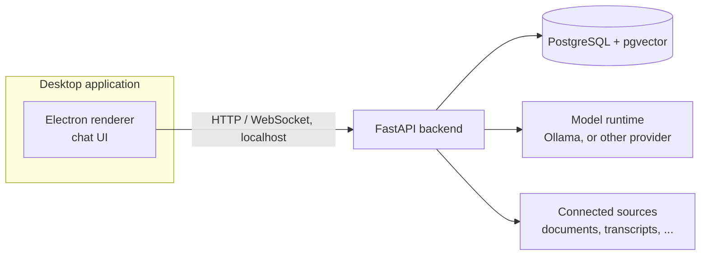

# System architecture

This document describes the system's components and how they fit together: the chat interface,
the backend, the memory store, and the model runtime. It complements the [memory
model](./memory-model.mdx), which defines what is stored, and [model
providers](./model-providers.mdx), which covers how LLM and embedding requests are served.

## Components

- **Frontend**: a desktop application built with Electron. This is the chat interface described
  in the [product vision](../product-vision/overview.mdx), packaged as a standalone application
  rather than a web app, so the user runs it like any other desktop tool without a separate
  server to reach over the network.
- **Backend**: a Python service built with FastAPI. It exposes the chat API, runs ingestion
  pipelines for connected sources, performs entity and fact extraction, and serves retrieval
  queries against the memory store.
- **Memory store**: a self-hosted PostgreSQL instance with the `pgvector` extension, as defined in
  the [memory model](./memory-model.mdx).
- **Model runtime**: Ollama by default, serving the LLM and embedding models used for extraction,
  retrieval, and chat. The backend talks to model runtimes through a provider abstraction, covered
  in [model providers](./model-providers.mdx), so this is not necessarily Ollama for every
  deployment or every operation.

## Communication

The Electron application is a client of the backend, not part of it: the backend runs as a local
process and exposes an HTTP API on `localhost`. The Electron main process will start and manage
the backend process for the user, so the application feels like a single program, while keeping
the backend independent of the UI: the same backend could later serve a different frontend, or run
on a different machine from the UI, without changing its API. (Backend process management and
streaming chat responses are not yet implemented; see the [frontend reference](../reference/frontend.mdx#what-is-not-here-yet).)

## Running the application

For the MVP, the application runs on a single machine, used by a single person:

- The backend, the database, and the model runtime run locally (the database and Ollama can run
  as local services or containers).
- The Electron application starts the backend process on launch, and stops it on exit.

This keeps the self-hosted, data-control principle from the [product
vision](../product-vision/overview.mdx#deployment-and-data-principles) straightforward for the
MVP: nothing leaves the user's machine unless a hosted model provider is explicitly configured
(see [model providers](./model-providers.mdx)). A future multi-tenant deployment, where the
backend and database run on shared infrastructure and the desktop application (or a future web
client) connects to them remotely, is a later step and does not require changing the API between
the frontend and the backend, only how the backend is reached.

## Open questions

- **Packaging and distribution**: how the backend, its Python dependencies, and the database are
  bundled with the Electron application for installation (for example, a bundled Python runtime
  versus requiring a local Python or Docker setup), to be resolved during Stage 1 implementation.
- **Multi-machine setup**: whether Stage 1 needs to support the backend and database running on a
  different machine from the Electron client, or whether this is deferred until a multi-tenant
  deployment is actually needed.
